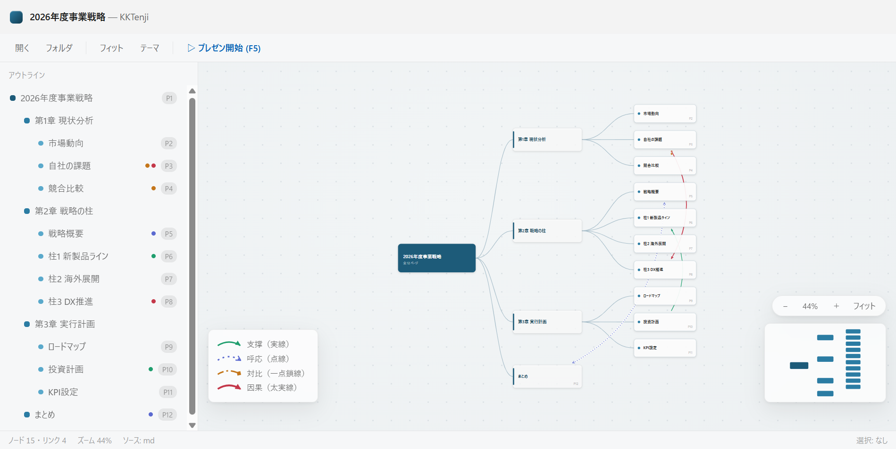

# KKTenji

PPT / Markdown の deck を「思維関係図」として描画・プレゼンする Windows 10+ デスクトップツール。

各ページがノードになり、章→節→頁の階層ツリーと、ページ間の関係線 4 種
（**支撑 / 呼応 / 対比 / 因果**、ベジェ弯弧・矢印で方向表示）で deck の論理構造を一望できます。
ノードをクリックするとカメラが滑らかに寄り、そのページのプレビューが展開。
F5 でプレゼンモードに入り、定義した flow 順に運鏡しながら講解できます。



## インストール

1. `KKTenji-Setup-x.x.x.exe` を実行（per-user、管理者権限不要）
2. **インストーラは未署名のため SmartScreen の青い警告が出ます。**
   「詳細情報」→「実行」の順にクリックすると続行できます（配布元が信頼できる場合のみ）
3. 起動して **「サンプルを開く」** で動作を確認

インストール後は、エクスプローラーの右クリック「KKTenji で開く」（.pptx / .md / フォルダ）や、
ウィンドウへのドラッグ&ドロップでも deck を開けます。

## 自分の deck を開く

コンテンツファイルと同名の sidecar `*.tenji.json` を同じフォルダに置きます:

- `deck.md` + `deck.tenji.json`（md はそのまま整形描画）
- `deck.pptx` + `deck.tenji.json`（ページ画像の生成にローカル PowerPoint が必要）
- sidecar の無い `.md` / `.pptx` を開くと、仮の関係図を自動生成して表示します（簡易表示）

**sidecar の作り方**: アプリ内の **「ヘルプ (?)」→「deck の作り方」** にある
「AI 用プロンプト雛形をコピー」を Claude などの AI 対話に貼り、資料の内容を渡すと
`*.tenji.json` が得られます。書式の正式定義は [schema/tenji-v1.schema.json](schema/tenji-v1.schema.json)。

## キーボード

| 鍵 | 動作 |
|---|---|
| Ctrl+O / Ctrl+Shift+O | ファイル / フォルダを開く |
| Ctrl+F ・ Enter / F3 | 検索 ・ 次のヒットへ（Shift で逆） |
| F | 全体フィット |
| Enter / Esc | 選択ノードをプレビュー / 戻る |
| + / − | プレビュー表示サイズ |
| F5 | プレゼン開始 |
| →/Space・← | プレゼン進・戻（飛行中の再押下は瞬達） |
| M / B | 俯瞰「今どこ」 / 暗転 |
| ? / F1 | ヘルプ（ショートカット一覧・deck の作り方） |

## 開発

```
npm install
npm run test      # Vitest（core ロジック）
npm run dev       # ブラウザで UI 開発（sample deck）
npm run electron  # Electron で起動
npm run dist      # NSIS インストーラを dist/ に生成
```

設計書: `docs/superpowers/specs/2026-07-19-kktenji-design.md` ／ 開発規約: `CLAUDE.md`

## 既知の制限（v1）

- インストーラは未署名（SmartScreen 警告が出ます。上記の手順で続行）
- pptx プレビューは静的 PNG（アニメーション・段階表示は反映されません）
- 複数 flow・プレゼンター用サブ画面・自動更新は未実装（設計書に予約済み）
- Electron ベースのためインストーラ約 95MB（将来 Tauri 移行で軽量化予定）
